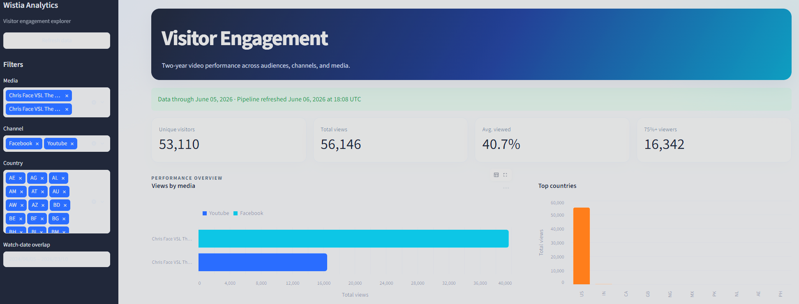
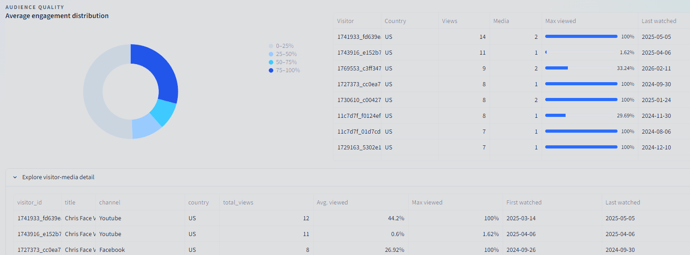
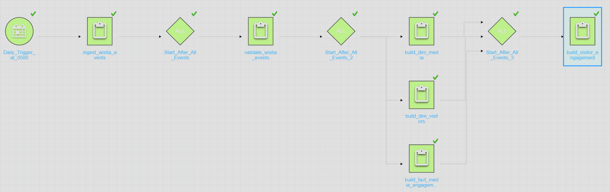
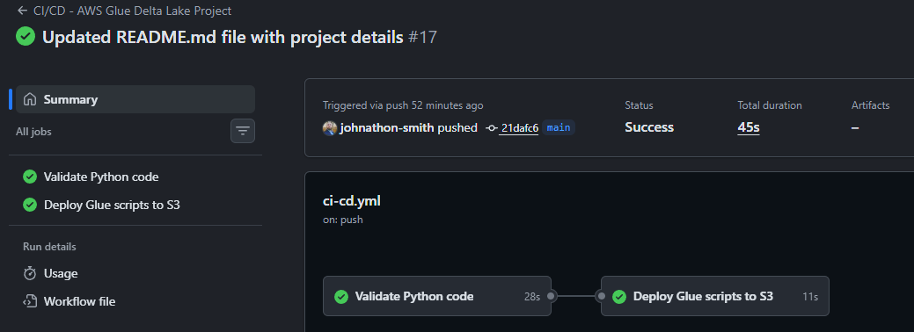
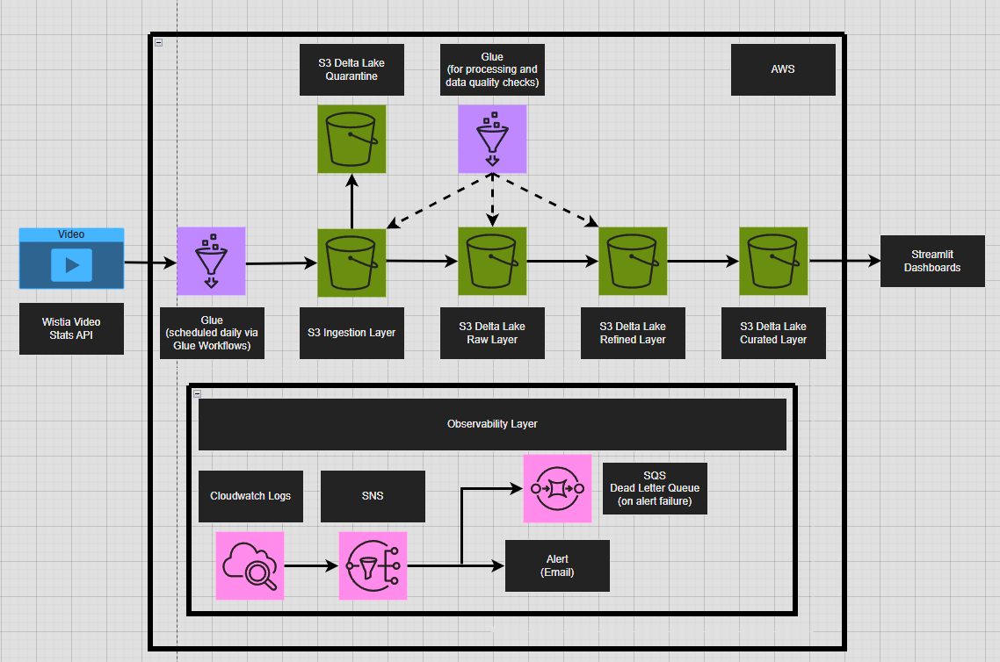
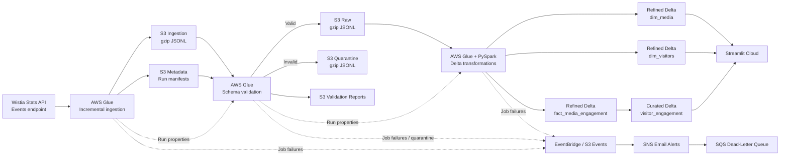

# Wistia Video Analytics AWS Pipeline

[](https://github.com/johnathon-smith/wistia_video_analytics_aws_pipeline/actions/workflows/ci-cd.yml)

An end-to-end AWS data engineering project that incrementally extracts video
engagement events from the Wistia Stats API, validates incoming JSON for schema
drift, models the data as Delta Lake tables, and serves audience insights through
an interactive Streamlit dashboard.

The pipeline was designed to demonstrate production-minded engineering on a
small, understandable workload: deterministic run lineage, idempotent upserts,
data-quality quarantine, workflow-aware job handoffs, operational alerting,
automated deployment, and visible data freshness.

## Project Highlights

- Extracts paginated Wistia Events API data for two media assets.
- Supports daily incremental loads and configurable historical backfills.
- Uses a five-layer S3 data lake: ingestion, quarantine, raw, refined, and curated.
- Detects missing, null, malformed, wrongly typed, and out-of-range fields.
- Preserves additive schema changes while reporting them as drift.
- Builds three refined Delta tables and one curated aggregate.
- Uses Delta `MERGE` operations for idempotent dimension and fact upserts.
- Passes run-specific manifest URIs through AWS Glue Workflow properties.
- Publishes pipeline freshness metadata to the Streamlit dashboard.
- Alerts by email for Glue failures and quarantined records, with an SQS DLQ.
- Deploys Glue scripts through GitHub Actions using AWS OIDC.
- Includes 61 unit tests plus Ruff linting and dashboard import checks.

The initial two-year backfill processed **56,153 Wistia engagement events**. The
same pipeline now runs incrementally each day and can replay an explicit date
range when historical recovery is needed.

## Visual Tour

### Streamlit Dashboard





### Orchestration and Delivery





## Architecture





## Technology Stack

| Area | Technology |
|---|---|
| Source | Wistia Stats API, Events endpoint, version `2026-03` |
| Compute | AWS Glue, Python, PySpark |
| Storage | Amazon S3, gzip JSONL, Delta Lake |
| Orchestration | AWS Glue Workflows and conditional triggers |
| Data quality | Python validation, manifests, quarantine routing |
| Dashboard | Streamlit Cloud, pandas, Altair, delta-rs |
| Observability | CloudWatch Logs, EventBridge, S3 events, SNS, SQS |
| Security | IAM, AWS Secrets Manager, GitHub Actions OIDC |
| CI/CD | GitHub Actions, Ruff, `unittest`, AWS CLI |

## Data Lake Design

| Layer | Purpose | Format |
|---|---|---|
| Ingestion | Landing zone for newly extracted API payloads before validation | gzip JSONL |
| Quarantine | Records that fail schema or value validation | gzip JSONL |
| Raw | Validated, append-only source history | gzip JSONL |
| Refined | Deduplicated dimensional and event-level models | Delta Lake |
| Curated | Dashboard-ready visitor and media aggregates | Delta Lake |
| Metadata | Ingestion manifests and validation reports | JSON |

Run manifests live outside the temporary ingestion prefix at:

```text
s3://<data-lake-bucket>/metadata/wistia/events/manifests/
```

Each manifest records the API version, extraction window, run ID, source objects,
media-level counts, and total event count. Downstream jobs use the manifest instead
of guessing which S3 object belongs to the current run.

## Data Models

### `dim_media`

**Grain:** one row per `media_id`

**Write strategy:** Delta upsert keyed by `media_id`

| Column | Source or rule |
|---|---|
| `media_id` | Wistia `media_id` |
| `title` | `media_name` |
| `url` | `media_url` |
| `channel` | Derived from `Youtube` or `Facebook` in the title |

When duplicate media records occur within a load, the most recently received
event supplies the current attributes.

### `dim_visitors`

**Grain:** one row per `visitor_id`

**Write strategy:** Delta upsert keyed by `visitor_id`

| Column | Source or rule |
|---|---|
| `visitor_id` | `visitor_key` |
| `ip_address` | `ip` |
| `country` | `country` |

The latest `received_at` value determines the visitor's current IP address and
country.

### `fact_media_engagement`

**Grain:** one row per Wistia event

**Write strategy:** Delta upsert keyed by `event_id`

| Column | Source or rule |
|---|---|
| `event_id` | `event_key` |
| `visitor_id` | `visitor_key` |
| `media_id` | Wistia `media_id` |
| `date` | UTC date derived from `received_at` |
| `watched_percent` | Wistia `percent_viewed`, retained on its `0-1` scale |

The fact table is intentionally unpartitioned at the current volume. Partitioning
by media, year, and month would create small files and unnecessary maintenance for
only two media IDs. A later migration can rewrite the table to a new location with
derived year and month columns when data volume justifies it.

### `visitor_engagement`

**Grain:** one row per unique `visitor_id` and `media_id` combination

**Write strategy:** complete recomputation from the refined fact table

| Column | Definition |
|---|---|
| `visitor_id` | Visitor identifier |
| `media_id` | Media identifier |
| `total_views` | Count of engagement events |
| `avg_pct_viewed` | Average `watched_percent` |
| `max_pct_viewed` | Maximum `watched_percent` |
| `first_date_watched` | Earliest event date |
| `last_date_watched` | Latest event date |
| `data_through_date` | Latest Wistia date processed successfully |
| `pipeline_refreshed_at` | UTC timestamp of the curated rebuild |
| `ingestion_run_id` | Ingestion run that initiated the refresh |

The curated table is fully recomputed because it is a compact aggregate and the
fact table is the source of truth. This prevents stale aggregates if historical
events are corrected or reprocessed.

## Pipeline Flow

### 1. Incremental API ingestion

[`ingest_wistia_events.py`](glue_jobs/ingest_wistia_events.py) retrieves every
page for each configured media ID and streams the results into gzip-compressed
JSON Lines files.

Scheduled runs default to yesterday in UTC, the latest fully completed day:

```text
START_DATE = yesterday UTC
END_DATE   = yesterday UTC
```

Manual backfills can override the window:

```text
--START_DATE 2026-05-01
--END_DATE 2026-05-31
```

Both dates must be supplied together in `YYYY-MM-DD` format. Requests use bounded
timeouts, exponential backoff with jitter, `Retry-After` handling, and explicit
failure messages for HTTP and response-shape errors.

### 2. Schema validation and quarantine

[`validate_wistia_events.py`](glue_jobs/validate_wistia_events.py) processes the
exact manifest published by ingestion. It requires and type-checks:

```text
event_key
received_at
visitor_key
media_id
media_name
media_url
percent_viewed
ip
country
```

Invalid JSON and records with missing, null, incorrectly typed, or out-of-range
values are written to quarantine. Unknown fields are allowed so additive API
changes do not stop the pipeline, but they are counted and reported as additive
schema drift.

A quarantine object is created only when invalid records exist. This makes an S3
object-created notification under the quarantine prefix a meaningful data-quality
alert rather than routine noise.

### 3. Refined Delta models

The three PySpark jobs read the validated raw object identified by the validation
report:

- [`build_dim_media.py`](glue_jobs/build_dim_media.py)
- [`build_dim_visitors.py`](glue_jobs/build_dim_visitors.py)
- [`build_fact_media_engagement.py`](glue_jobs/build_fact_media_engagement.py)

Each job validates its inputs, deduplicates the current batch, and uses Delta
`MERGE` semantics so rerunning the same ingestion does not create duplicate rows.

### 4. Curated aggregation

[`build_visitor_engagement.py`](glue_jobs/build_visitor_engagement.py) rebuilds
the visitor-media aggregate from the complete fact table and atomically overwrites
the curated Delta table with schema evolution enabled.

### 5. Streamlit analytics

[`streamlit_app/app.py`](streamlit_app/app.py) reads Delta tables directly from S3
with delta-rs. The dashboard provides:

- Media, channel, country, and watch-date filters.
- Unique visitors, total views, average completion, and high-intent viewer KPIs.
- Views by media and top-country visualizations.
- Audience-quality distribution bands.
- Top-visitor analysis and downloadable visitor-media detail.
- A visible `Data through` date and pipeline refresh timestamp.
- A 15-minute data cache plus manual refresh control.

## Workflow Orchestration

The jobs support both manual execution and AWS Glue Workflow execution. Workflow
runs receive `--WORKFLOW_NAME` and `--WORKFLOW_RUN_ID` automatically.

The ingestion job publishes:

```text
INGESTION_MANIFEST_URI
INGESTION_RUN_ID
INGESTION_START_DATE
INGESTION_END_DATE
```

Validation consumes the manifest and publishes its report URI and record counts.
Refined jobs consume the validation report. The curated job verifies that the fact
table was updated by the same ingestion run before rebuilding the aggregate.

Recommended trigger sequence:

```text
Scheduled ingestion
    -> validation after ingestion SUCCEEDED
    -> refined jobs after validation SUCCEEDED
    -> curated job after fact_media_engagement SUCCEEDED
```

This run-property contract prevents a downstream job from accidentally processing
an older S3 object or mixing artifacts from different workflow executions.

## Observability

The production environment uses console-configured AWS services:

- CloudWatch Logs for Glue execution logs.
- EventBridge rules for Glue `FAILED`, `TIMEOUT`, and `STOPPED` states.
- SNS email notifications for job failures.
- S3 event notifications for objects created under
  `quarantine/wistia/events/`.
- An SQS dead-letter queue for failed alert delivery.
- Validation reports containing valid, quarantined, malformed, and drift counts.

The dashboard's freshness indicator is based on the successful ingestion window,
not the latest viewer event. This distinction matters because a fully processed day
can legitimately contain no video activity.

## Engineering Challenges

| Challenge | Resolution |
|---|---|
| Paginated two-year historical extraction | Iterated through every API page per media ID while streaming gzip JSONL to temporary storage to control memory use. |
| Daily loads initially repeated full history | Added optional start/end parameters and defaulted scheduled runs to the latest completed UTC day. |
| Passing the correct object between Glue jobs | Published the exact manifest URI and run ID through Glue Workflow run properties. |
| Detecting schema drift without blocking additive changes | Enforced required fields and value rules while recording unknown fields as non-breaking additive drift. |
| False quarantine alerts from empty output files | Deferred the S3 upload and created a quarantine object only when at least one record failed. |
| Preventing duplicate facts during reruns | Deduplicated by `event_id` and used a Delta upsert keyed on the same identifier. |
| Choosing a partition strategy too early | Kept the small fact table unpartitioned to avoid tiny files and documented a future migration path. |
| Showing trustworthy dashboard freshness | Carried the ingestion end date and run ID into the curated model instead of inferring freshness from viewing activity. |
| Streamlit Cloud Altair import failure | Diagnosed a Python 3.14 and Altair 5.5 `TypedDict` incompatibility and upgraded to Altair 6.1. |
| CI missing dashboard dependencies | Installed the Streamlit requirements in the development dependency chain and added a dashboard import smoke test. |
| Secure AWS deployment from GitHub | Used GitHub Actions OIDC role assumption instead of long-lived AWS access keys. |

## Reliability and Idempotency

- Every ingestion receives a unique run ID.
- Manifests and validation reports preserve run-level lineage.
- API retries are limited and applied only to transient failures.
- Validation routes bad records instead of silently discarding them.
- Dimension and fact tables use deterministic merge keys.
- Curated output is rebuilt from the authoritative fact table.
- Workflow jobs verify matching ingestion run IDs.
- Manual parameters override workflow properties for controlled backfills.
- Secrets are read from AWS Secrets Manager and never stored in source code.

## Repository Structure

```text
.
|-- .github/workflows/ci-cd.yml
|-- glue_jobs/
|   |-- ingest_wistia_events.py
|   |-- validate_wistia_events.py
|   |-- build_dim_media.py
|   |-- build_dim_visitors.py
|   |-- build_fact_media_engagement.py
|   `-- build_visitor_engagement.py
|-- streamlit_app/
|   |-- .streamlit/
|   |   |-- config.toml
|   |   `-- secrets.toml.example
|   |-- app.py
|   |-- data_access.py
|   |-- demo_data.py
|   `-- requirements.txt
|-- tests/
|-- pyproject.toml
`-- requirements-dev.txt
```

## AWS Setup

### Glue job requirements

The ingestion and validation scripts run as Python Glue jobs. The refined and
curated jobs require Glue Spark with Delta enabled:

```text
--datalake-formats delta
--conf spark.sql.extensions=io.delta.sql.DeltaSparkSessionExtension --conf spark.sql.catalog.spark_catalog=org.apache.spark.sql.delta.catalog.DeltaCatalog
```

Core ingestion parameters:

```text
--SECRET_ID <secrets-manager-secret>
--S3_BUCKET <data-lake-bucket>
--MEDIA_IDS gskhw4w4lm,v08dlrgr7v
--S3_PREFIX ingestion/wistia/events
--MANIFEST_PREFIX metadata/wistia/events/manifests
```

Do not add blank `--START_DATE` or `--END_DATE` arguments to the scheduled job.
Omit both to use the automatic daily window.

### IAM permissions

Scope permissions to the required bucket prefixes and resources. Depending on the
job, the shared Glue role requires:

```text
glue:GetWorkflowRunProperties
glue:PutWorkflowRunProperties
s3:GetObject
s3:PutObject
s3:ListBucket
secretsmanager:GetSecretValue
```

Add `s3:DeleteObject` for Delta maintenance operations that remove files, and KMS
permissions when customer-managed keys are used.

### Streamlit secrets

Copy the structure from
[`secrets.toml.example`](streamlit_app/.streamlit/secrets.toml.example):

```toml
[aws]
region = "us-east-1"
access_key_id = "REPLACE_ME"
secret_access_key = "REPLACE_ME"
# session_token = "REPLACE_ME"

[tables]
visitor_engagement_uri = "s3://your-data-lake/curated/visitor_engagement"
dim_media_uri = "s3://your-data-lake/refined/dim_media"
dim_visitors_uri = "s3://your-data-lake/refined/dim_visitors"
```

The Streamlit identity needs read-only `s3:ListBucket` and `s3:GetObject`
permissions scoped to the Delta table prefixes.

## Local Development

Install dependencies and run the test suite:

```bash
python -m pip install -r requirements-dev.txt
python -m ruff check glue_jobs streamlit_app tests
python -m unittest discover -s tests -v
```

Run the dashboard with synthetic data:

```bash
WISTIA_DASHBOARD_DEMO_MODE=true streamlit run streamlit_app/app.py
```

On Windows PowerShell:

```powershell
$env:WISTIA_DASHBOARD_DEMO_MODE = "true"
streamlit run streamlit_app/app.py
```

## CI/CD

The GitHub Actions workflow:

1. Installs Python and all development/dashboard dependencies.
2. Runs Ruff against Glue jobs, Streamlit code, and tests.
3. Verifies that Altair, Delta Lake, pandas, and Streamlit import successfully.
4. Runs all unit tests.
5. Assumes an AWS IAM role through GitHub OIDC.
6. Synchronizes Glue scripts to the configured S3 script prefix after successful
   validation on `main`.

No long-lived AWS credentials are stored in GitHub.

## Future Enhancements

- Add infrastructure as code after the console-built AWS design stabilizes.
- Add automated end-to-end tests against a non-production AWS environment.
- Monitor freshness thresholds and DLQ depth with CloudWatch alarms.
- Compact and optimize Delta files as data volume grows.
- Partition the fact table only after query patterns and volume justify it.
- Replace static Streamlit credentials with short-lived or brokered access.
- Add more media assets and parameterize channel classification rules.

## What This Project Demonstrates

This project showcases practical experience with:

- Designing layered data lakes and dimensional models.
- Building resilient REST API ingestion with pagination and retries.
- Implementing schema validation, quarantine, and drift monitoring.
- Writing idempotent PySpark and Delta Lake transformations.
- Orchestrating dependent jobs with AWS Glue Workflows.
- Managing lineage and freshness across distributed pipeline stages.
- Building and deploying interactive analytics applications.
- Applying least-privilege IAM, secrets management, observability, and CI/CD.

The result is a compact but complete production-style analytics system: source to
dashboard, with the reliability and operational controls needed to trust the data.
